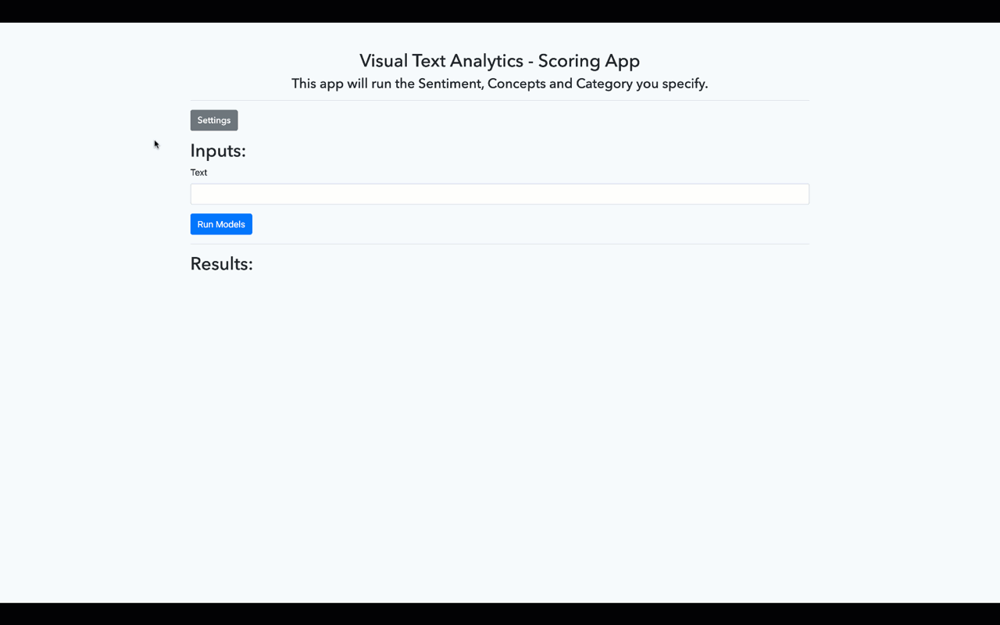

# Visual Text Analytics Model Scoring

## Overview

This app fully leverages our Viya/CAS APIs. It is a good way to demonstrate how one can operationalize text models (not only ML ones).

Here a few things you need to know before using it:

1. You should try it before showing it to customers. I haven't handled all the possible errors... 

2. This app can score:
    1. Sentiment
    2. Concept
    3. Categories

3. On the settings page you can add your username and password, model ASTORES and model CASLIb.
    1. In order to get this information you need to go through each node on your VTA project to get them from the code generated by SAS. Here is a step by step:
    
    2. Generally the model library is the same for both models.
    3. The sentiment model doesn't require an ASTORE, so you will need to go through this process only for the concept and categories node.
    
4. If you want to use your own models, make sure you change the user/password on the app's interface. 

## Before Running

### Python requirements

1. Flask
2. Pandas

### Edit needed

On the `app.py` file edit line 30 `encoded_c_s` to match your encoded client / secret generated.

To get all the details on authentication, feel free to read this [blog](https://developer.sas.com/reference/auth/#register.)

After you have registered your client and secret, you can use this website to generate the encoded [client/secret](https://base64.guru/converter) 

You should enter something like this: `client:secret` and it should return something like `o8PzNmFj1g==`

## Running the app

On your linux machine (or windows) go on the terminal and run:

- `flask run`

Any feedback is appreciated.
Feel free to make pull requests.